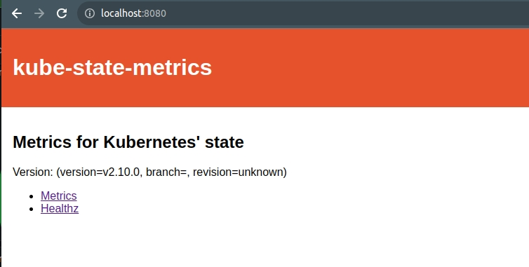
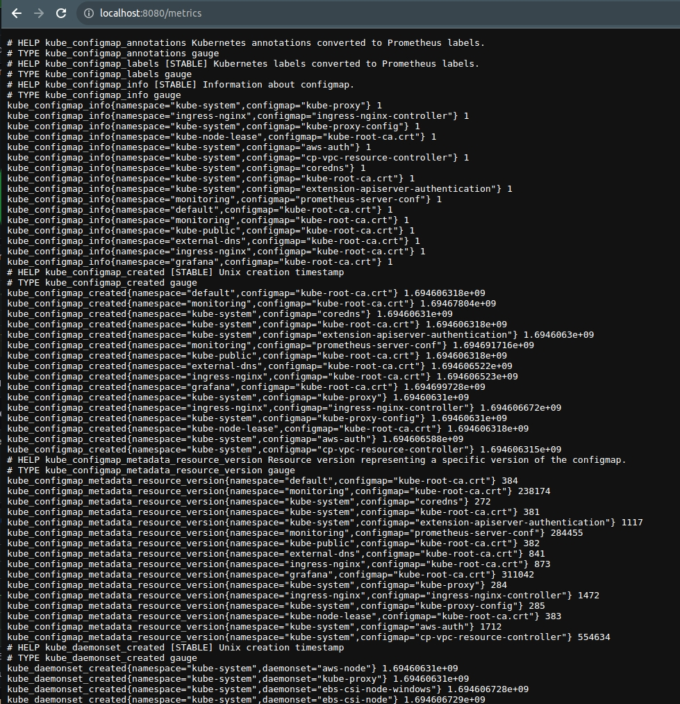

# Installing Kube-State-Module

--> Proceed with these steps after install prometheus

* Install ksm

```commandline
kubectl apply -f ./ksm-standard/
```

* Test metrics

```commandline
kubectl port-forward svc/kube-state-metrics -n kube-system 8080:8080
```

* Go to http://localhost:8080 



and click on metrics


